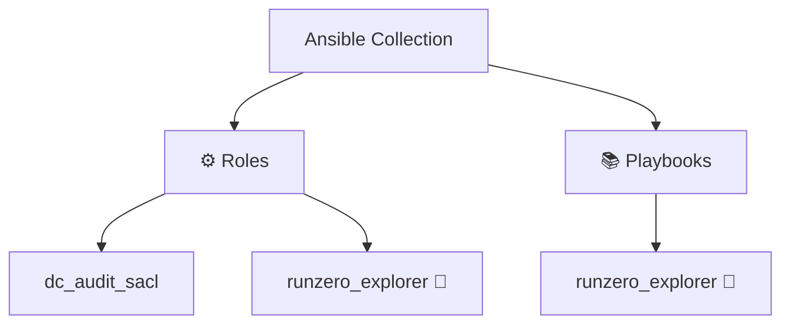

# Ansible Collection: Bulwark

[](https://github.com/l50/ansible-collection-bulwark/blob/main/LICENSE)
[](https://github.com/l50/ansible-collection-bulwark/actions/workflows/pre-commit.yaml)
[](https://github.com/l50/ansible-collection-bulwark/actions/workflows/molecule.yaml)
[](https://github.com/l50/ansible-collection-bulwark/actions/workflows/renovate.yaml)

This Ansible collection provides setup and configuration for defensive security
tools, covering utilities and applications for threat detection, incident
response, and system hardening.

## Architecture Diagram



## Requirements

- Ansible 2.15 or higher

## Installation

Install the latest version of the Bulwark collection:

```bash
ansible-galaxy collection install git+https://github.com/l50/ansible-collection-bulwark.git,main
```

Alternatively, you can build the collection locally and install it from
the generated tarball:

```bash
ansible-galaxy collection build --force && \
  ansible-galaxy collection install l50-bulwark-*.tar.gz -p ~/.ansible/collections --force --pre
```

## Roles

<!-- ROLES TABLE START -->

| Role | Description |
| ---- | ----------- |
| [`dc_audit_sacl`](roles/dc_audit_sacl/README.md) | Configure SACL auditing on Domain Controllers for attack detection |
| [`runzero_explorer`](roles/runzero_explorer/README.md) | Install the runZero explorer |

<!-- ROLES TABLE END -->

### DC Audit SACL

Configures SACL entries and `auditpol` subcategories on a Windows Domain
Controller so that DCSync-style replication attempts (and other Directory
Service Access events) are audited. Windows Server 2019/2022 only; no
molecule test coverage (needs a real AD forest).

### runZero Explorer

Installs and configures [runZero Explorer](https://console.runzero.com/deploy/download/explorers).

## Usage

Include the roles from this collection in your playbook. Here's an example:

```yaml
---
- name: Provision system
  hosts: localhost
  roles:
    - l50.bulwark.runzero_explorer
    ...
```

## Development

### Setting Up Development Environment

To set up the development environment and install all required dependencies,
including docsible for automatic documentation generation:

```bash
python3 -m pip install -r .hooks/requirements.txt
```

### Documentation Generation

This project uses [docsible](https://github.com/docsible/docsible) to automatically
generate documentation for Ansible roles. Documentation is generated automatically
via pre-commit hooks when changes are made to role files.

## License

This collection is licensed under the MIT License - see the [LICENSE](LICENSE)
file for details.

## Support

- Repository: [l50/ansible-collection-bulwark](https://github.com/l50/ansible-collection-bulwark)
- Issue Tracker: [GitHub Issues](https://github.com/l50/ansible-collection-bulwark/issues)

## Authors

- Jayson Grace ([techvomit.net](https://techvomit.net))
